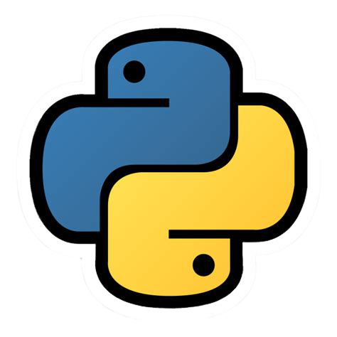

     
    
    

## ✨ Python Brasil Exercícios
Esse repositório foi criado com o objetivo de centralizar todas as minhas soluções dos exercícios do site [Python Brasil](https://wiki.python.org.br/PythonBrasil), os exercícios foram resolvidos com o <strong>python na versão 3.9.0</strong>. Espero que, de alguma maneira, esse repositório possa colaborar com seus estudos.

## 🚀 Começando

[Python 3+](https://www.python.org/downloads/)

## 🎫 Licença

Esse projeto é licenciado nos termos da licença open-source [MIT Licence](https://opensource.org/licenses/MIT) e está disponível de graça.

## 📑 Sumário
1.  [Estrutura sequêncial](https://github.com/joaovictorvilela/Python-Brasil-Exercicios/blob/main/01%20-%20Estrutura%20Sequ%C3%AAncial/README.md)
2.  [Estrutura de decisão](https://github.com/joaovictorvilela/Python-Brasil-Exercicios/blob/main/02%20-%20Estrutura%20de%20Decis%C3%A3o/README.md)
3.  [Estrutura de repetição](https://github.com/joaovictorvilela/Python-Brasil-Exercicios/blob/main/03%20-%20Estrutura%20de%20Repeti%C3%A7%C3%A3o/README.md)
4.  [Exercícios de listas](https://github.com/joaovictorvilela/Python-Brasil-Exercicios/blob/main/04%20-%20Exerc%C3%ADcios%20de%20Listas/README.md)
5.  [Exercícios de funções](https://github.com/joaovictorvilela/Python-Brasil-Exercicios/blob/main/05%20-%20Exerc%C3%ADcios%20de%20Fun%C3%A7%C3%B5es/README.md)
6.  [Exercícios com strings](https://github.com/joaovictorvilela/Python-Brasil-Exercicios/blob/main/06%20-%20Exerc%C3%ADcios%20com%20Strings/README.md)
7.  [Exercícios com arquivos](https://github.com/joaovictorvilela/Python-Brasil-Exercicios/blob/main/07%20-%20Exerc%C3%ADcios%20com%20Arquivos/README.md)
8.  [Exercícios com classes](https://github.com/joaovictorvilela/Python-Brasil-Exercicios/blob/main/08%20-%20Exerc%C3%ADcios%20de%20Classes/README.md)
